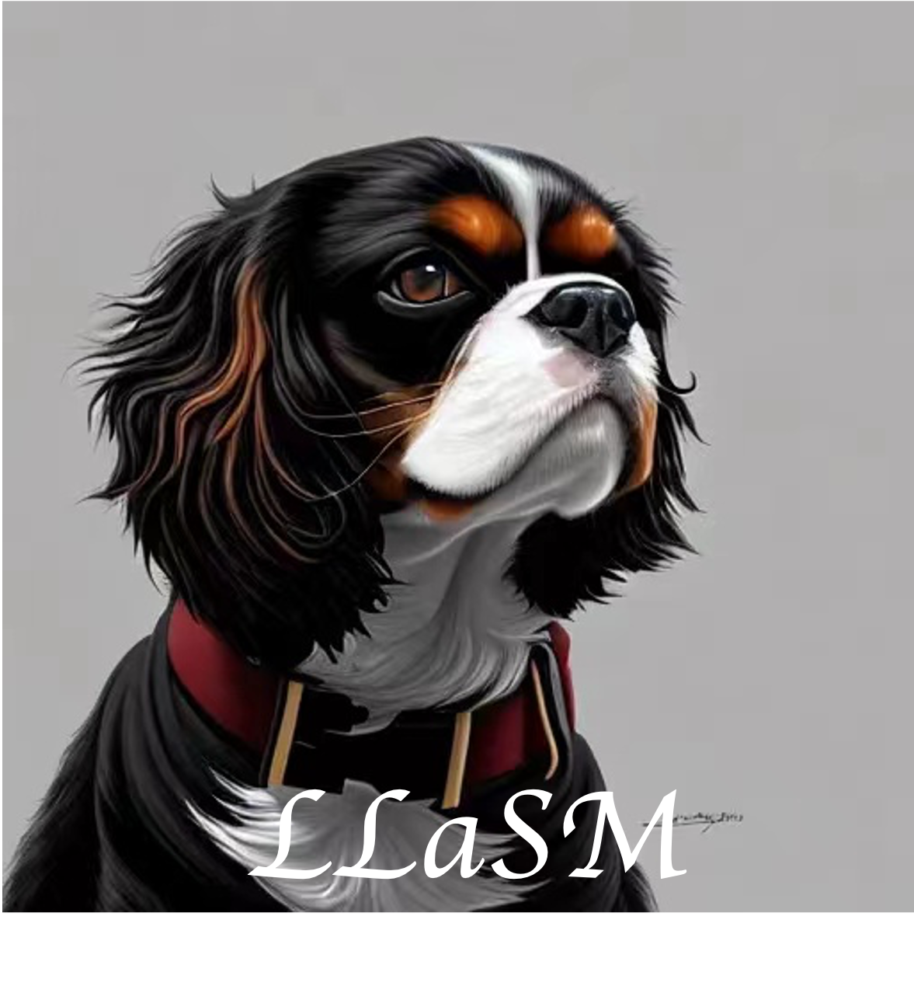
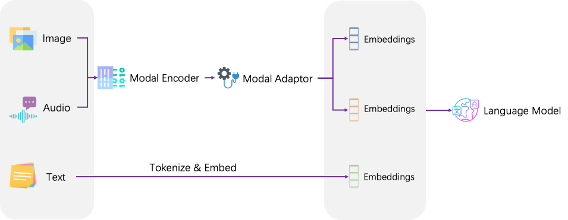
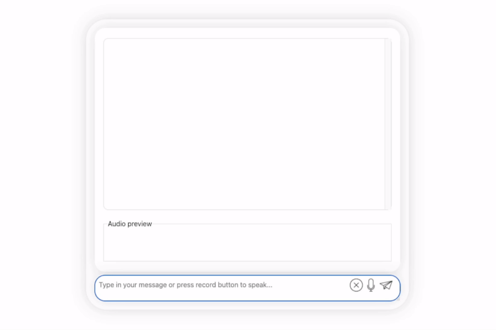

# LLaSM: Large Language and Speech Model

[](https://huggingface.co/spaces/LinkSoul/LLaSM) [](https://huggingface.co/spaces/LinkSoul/LLaSM) [](https://github.com/LinkSoul-AI/LLaSM/blob/main/LICENSE) [](https://arxiv.org/abs/2308.15930) [](https://huggingface.co/spaces/LinkSoul/LLaSM) [](https://huggingface.co/datasets/LinkSoul/LLaSM-Audio-Instructions)

开源，可商用的**中英文双语语音-语言助手 LLaSM 以及中英文语音 SFT 数据集 LLaSM-Audio-Instructions**，第一个支持中英文语音-文本多模态对话的开源可商用对话模型。

<p align="center">
    
</p>

## 模型框架



## 基础演示



## 在线试玩

> Talk is cheap, Show you the Demo.
- [Demo 地址 / HuggingFace Spaces](https://huggingface.co/spaces/LinkSoul/LLaSM) 

## 论文
- arXiv 链接：https://arxiv.org/abs/2308.15930

## 资源下载

- HuggingFace模型下载：
  - [LLaSM-Chinese-Llama-2-7B](https://huggingface.co/LinkSoul/LLaSM-Cllama2)
  - [LLaSM-Baichuan-7B](https://huggingface.co/LinkSoul/LLaSM-Baichuan)

- 百度网盘下载:
  - [LLaSM-Chinese-Llama-2-7B](https://pan.baidu.com/s/1PaipNDfqV7f3W1-tl5rwzA?pwd=2549)
  - [LLaSM-Baichuan-7B](https://pan.baidu.com/s/1QZrXA8IJXclN77T4jM7tEw?pwd=y2p7)

- 语言模型:
  - [Chinese-Llama-2-7b](https://github.com/LinkSoul-AI/Chinese-Llama-2-7b)
  - [Baichuan-7B](https://huggingface.co/baichuan-inc/Baichuan-7B)

- 数据集：[LLaSM-Audio-Instructions](https://huggingface.co/datasets/LinkSoul/LLaSM-Audio-Instructions)

## 环境安装
```shell
# clone the repository
git clone https://github.com/LinkSoul-AI/LLaSM
cd LLaSM

# install package
conda create -n llasm python=3.10 -y
conda activate llasm
pip install --upgrade pip
pip install -e .
```

## 快速测试

```shell
export LLASM_DEVICE="cuda:0"
python infer.py \
    --input_audio_file PATH/TO/YOUR/AUDIO \
    --llasm_model PATH/TO/LLaSM/MODEL \
    --llasm_audio_tower PATH/TO/WHISPER/MODEL \
    --llm_type "Chinese_llama2" or "baichuan" \
```

## TODO
- 如何训练
- int4 量化
- docker 部署

## 相关项目
- [Chinese-Llama-2-7B](https://huggingface.co/LinkSoul/Chinese-Llama-2-7b)
- [Whisper](https://ai.meta.com/llama/)
- [baichuan-inc/Baichuan-7B](https://huggingface.co/baichuan-inc/Baichuan-7B)


## 项目协议

[Apache-2.0 license](https://github.com/LinkSoul-AI/LLaSM/blob/main/LICENSE)

## Citation

如果您发现我们的工作和此仓库有用，欢迎给一个星星 :star: 鼓励我们一下 :beer::
```bibtex
@misc{shu2023llasm,
      title={LLaSM: Large Language and Speech Model}, 
      author={Yu Shu and Siwei Dong and Guangyao Chen and Wenhao Huang and Ruihua Zhang and Daochen Shi and Qiqi Xiang and Yemin Shi},
      year={2023},
      eprint={2308.15930},
      archivePrefix={arXiv},
      primaryClass={cs.CL}
}
```

## 微信交流群


